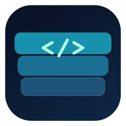
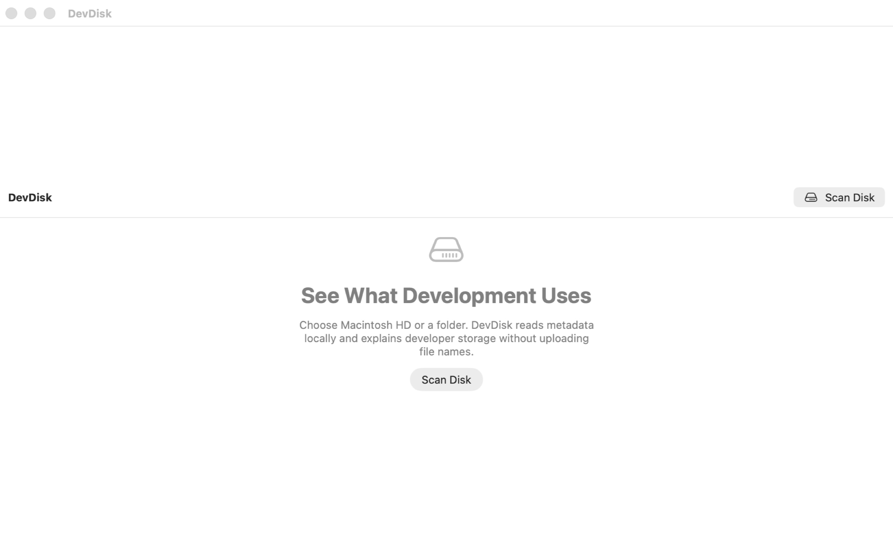

# DevDisk

<p align="center"></p>

DevDisk is a free, open-source developer storage analyzer for macOS. It scans only locations you choose, shows an expandable filesystem tree with allocated and logical sizes, and explains which developer tools produced the storage.

There is no paywall, StoreKit integration, telemetry or cloud upload. Every first-iteration feature is available to everyone under Apache-2.0.



## What it does

- Virtualized AppKit outline with Name, Allocated, Logical, Files, Modified and Growth columns.
- Live batched scan progress, cancellation, hard-link deduplication, symlink-cycle protection and per-folder refresh.
- Search, sorting and filters for ecosystem, risk and artifact type.
- Developer Insights for projects, ecosystems and artifact categories.
- Up to 10 local aggregate history snapshots with directory and category diffs.
- CSV export with correctly escaped Unicode paths and project names.
- Strict cleanup allowlist. The ordinary filesystem is read-only.

DevDisk can move only verified `safeRebuildable` artifacts to the macOS Trash. It validates the path, artifact kind and current project marker again immediately before the operation. Global caches, SDKs, simulators, dependencies, Docker data, archives and Git storage remain read-only.

## Detector coverage

| Ecosystem | First-iteration coverage |
| --- | --- |
| Apple | DerivedData, Archives, DeviceSupport, CoreSimulator, SwiftPM, CocoaPods |
| Android/JVM | Project builds and `.gradle`, global Gradle caches, Android SDK/system images, AVD, Maven output |
| Flutter | `.dart_tool`, `build`, pub cache, nested Android and Apple artifacts |
| Web/Node | React/Next/Vue/Nuxt/Vite/Turbo/Nx caches, `node_modules`, npm/Yarn/pnpm caches |
| Homebrew | Download/cache storage (reported as tool-managed) |
| Rust | Project `target`, Cargo registry and Git caches |
| C/C++ | Confirmed CMake build trees, Conan and vcpkg caches |
| Other | Python bytecode/virtualenvs, Git object storage, Docker storage |

One URL is emitted once even when it has several ecosystem tags. Nested artifacts stay visible for explanation, while aggregate storage accounting uses the outermost owner so Flutter/Android/Apple bytes are not counted twice.

Every global detector records whether its path came from a documented default, environment variable, tool configuration, or tool-owned metadata. See the [detector source and resolution matrix](docs/detector-sources.md); the same provenance is visible inside the app.

## Requirements

- macOS 14 or newer
- A current Xcode toolchain with the macOS 14 SDK or newer
- [XcodeGen](https://github.com/yonaskolb/XcodeGen)

## Build and test

```sh
xcodegen generate
xcodebuild -project DevDisk.xcodeproj -scheme DevDisk -destination 'platform=macOS' CODE_SIGNING_ALLOWED=NO build
xcodebuild -project DevDisk.xcodeproj -scheme DevDisk -destination 'platform=macOS' CODE_SIGNING_ALLOWED=NO test
```

Fastlane is installed through Bundler. From the repository root:

```sh
bundle install
bundle exec fastlane lanes
bundle exec fastlane mac validate_store_content
bundle exec fastlane mac verify
bundle exec fastlane mac deploy
```

Store metadata follows Fastlane's `fastlane/metadata` layout (`en-US` for localized fields) and screenshots live in `fastlane/screenshots/en-US`. Apple team and account values are optional environment variables documented in `fastlane/Appfile`; no credentials are committed.

`fastlane mac deploy` validates the metadata, runs the tests, creates a signed Mac App Store `.pkg`, and uploads the binary and metadata with the App Store Connect API key. It derives the next build number from App Store Connect and does not submit the version for review by default. Optional overrides use Fastlane's key/value syntax:

```sh
bundle exec fastlane mac deploy build_number:2026081123 version:1.0 screenshots:true submit:false
```

The Xcode project is generated from `project.yml`. Commit changes to both the YAML and generated project so CI can validate that they agree.

## Privacy and sandbox limitations

Scanning and detection run locally. The SQLite scan database and security-scoped bookmark are stored in the app container. DevDisk has no analytics, account, advertising or networking layer. See the [privacy policy](docs/privacy.md).

The macOS sandbox means DevDisk sees only the volume or folder selected through the system picker. System protections may still make some directories inaccessible; these are shown as unavailable instead of being reported as empty. The deploy lane requires local distribution signing credentials and does not submit a version for App Store review unless `submit:true` is passed explicitly.

## Adding JSON detectors

Simple project-relative detectors live in [`detector-rules.json`](DevDisk/Resources/detector-rules.json) and are checked against the repository's [`detector-rules.schema.json`](DevDisk/Resources/detector-rules.schema.json) shape plus runtime safety constraints. A rule must provide a unique `id`, project scope, one or more `ecosystems`, `projectMarkers`, safe exact project-relative `pathPatterns`, an `artifactKind`, `risk`, `cleanupPolicy` and user-facing `description`.

Use `cleanupPolicy: "none"` by default. `safeRebuildable` is restricted in code to the documented allowlist. A detector must cite a primary source and define its configuration precedence before code is added. Global or tool-specific layouts belong in a Swift detector where their structure can be validated. See [CONTRIBUTING.md](CONTRIBUTING.md).

## Architecture

```text
SwiftUI/AppKit UI → ViewState → Core use cases/protocols ← filesystem, detector and SQLite services
```

The scanner and analyzers work off the main actor. Scan events are delivered in batches so a large tree does not create one UI mutation per file.

## Support and release material

- [Support](docs/support.md)
- [App Store metadata](fastlane/metadata/en-US)
- [CI and unsigned archive validation](.github/workflows/ci.yml)
- [GitHub Pages workflow](.github/workflows/pages.yml)

## License

Apache License 2.0. See [LICENSE](LICENSE).
